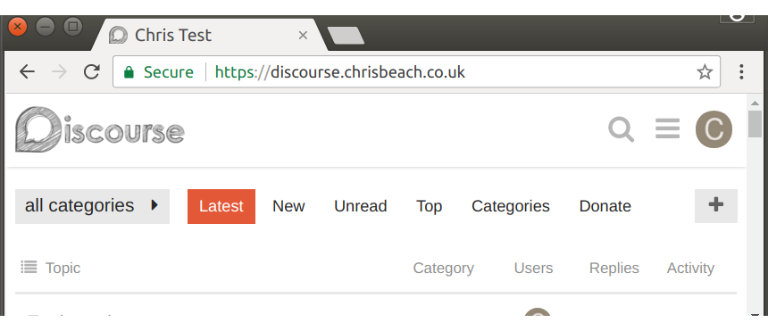
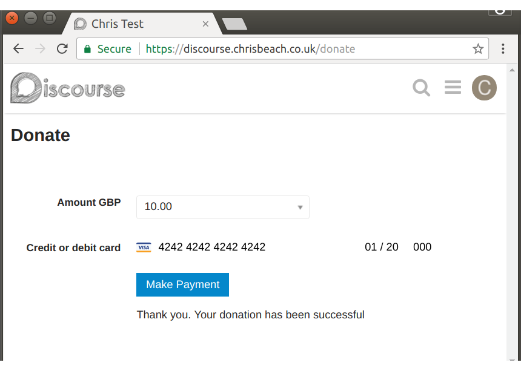

# Discourse Donations

Accept donations from visitors to your [Discourse](https://www.discourse.org/) forum. Integrates with [Stripe](https://stripe.com).

## Installation

* Be sure your site is enforcing https.
* Follow the install instructions here: https://meta.discourse.org/t/install-a-plugin/19157
* Add your Stripe public and private keys in settings and set the currency to your local value.
* Enable the plugin and wait for people to donate money.

## Usage

1. Click **Donate**:

1. Enter card details:

1. Click **Make Payment**:

## Creating new user accounts

**This is an experimental feature.** A user can create a new account if they makes a successful donation. Enable this in settings. When a user is not logged in, they will be asked to enter details for a new user account. This feature doesn't support mandatory custom user fields yet.

## Testing

* To run the rails specs, install the plugin and run `bundle exec rake plugin:spec[discourse-donations]` in the discourse root directory.
* To run qunit tests: `MODULE='Acceptance: Discourse Donations' bundle exec rake qunit:test[20000]`.
* To run Component tests: `MODULE='component:stripe-card' bundle exec rake qunit:test[20000]`.

**Note:**

* If you're using a zsh shell, then you probably get this error: `zsh: no matches found ...` and you'll need to escape the square brackets with backslashes.

## TODO

* Handle custom fields

## Tested Credit Card Numbers

These numbers can be used in test mode to simulate a transaction. For more information see the [Stripe docs](https://stripe.com/docs/testing).

Card numbers in **bold** have been tested.

* **4000 0000 0000 0077**	Charge succeeds and funds will be added directly to your available balance (bypassing your pending balance).
* **4000 0000 0000 0093**	Charge succeeds and domestic pricing is used (other test cards use international pricing). This card is only significant in countries with split pricing.
* **4000 0000 0000 0010**	The address_line1_check and address_zip_check verifications fail. If your account is blocking payments that fail postal code validation, the charge is declined.
* **4000 0000 0000 0028**	Charge succeeds but the address_line1_check verification fails.
* **4000 0000 0000 0036**	The address_zip_check verification fails. If your account is blocking payments that fail postal code validation, the charge is declined.
* **4000 0000 0000 0044**	Charge succeeds but the address_zip_check and address_line1_check verifications are both unavailable.
* **4000 0000 0000 0101**   If a CVC number is provided, the cvc_check fails. If your account is blocking payments that fail CVC code validation, the charge is declined.
* **4000 0000 0000 0341**	Attaching this card to a Customer object succeeds, but attempts to charge the customer fail.
* **4000 0000 0000 9235**	Charge succeeds with a risk_level of elevated and placed into review.
* **4000 0000 0000 0002**	Charge is declined with a card_declined code.
* **4100 0000 0000 0019**	Charge is declined with a card_declined code and a fraudulent reason.
* **4000 0000 0000 0127**	Charge is declined with an incorrect_cvc code.
* **4000 0000 0000 0069**	Charge is declined with an expired_card code.
* **4000 0000 0000 0119**	Charge is declined with a processing_error code.
* 4242 4242 4242 4241	Charge is declined with an incorrect_number code as the card number fails the Luhn check.

## Warranty

This software comes with no warranty of any kind.
