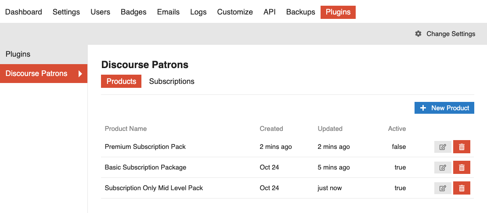
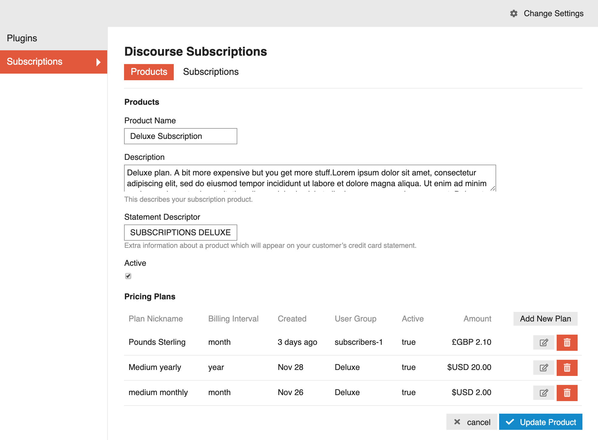
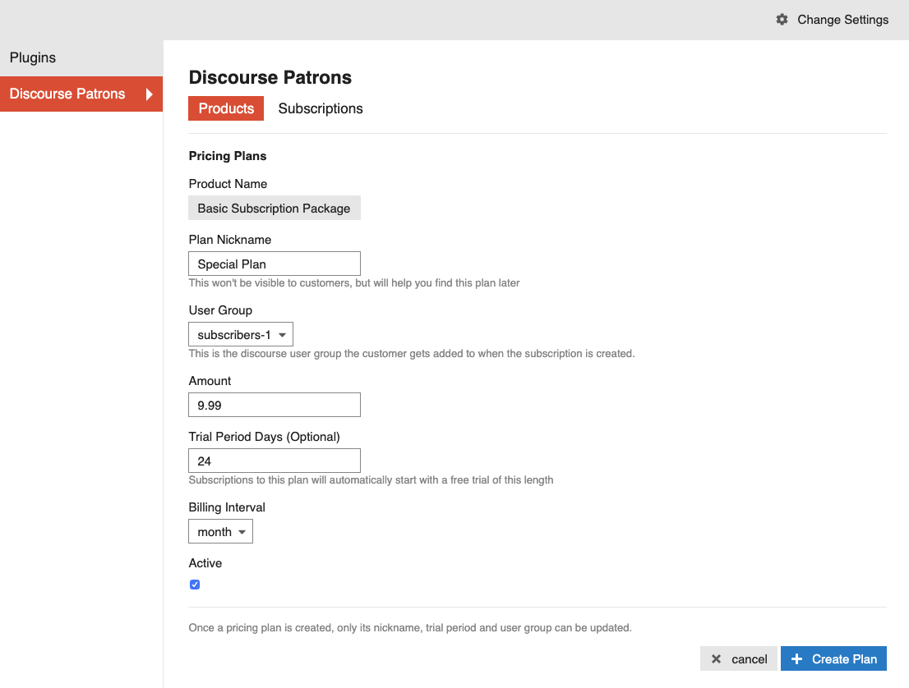
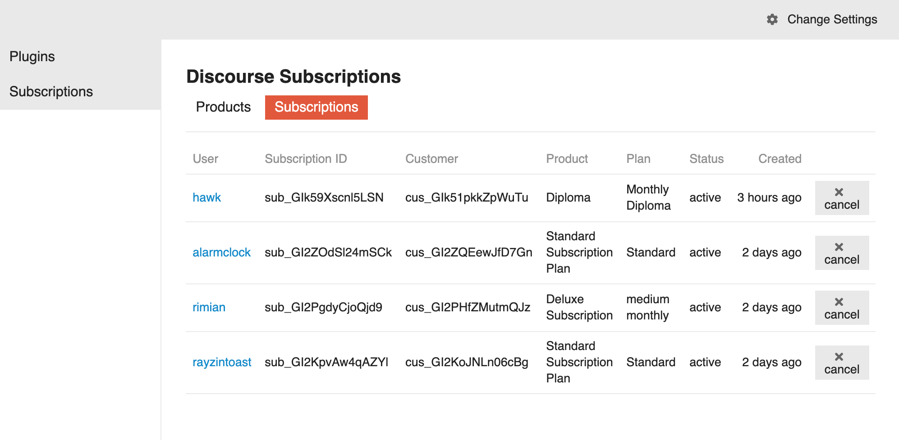
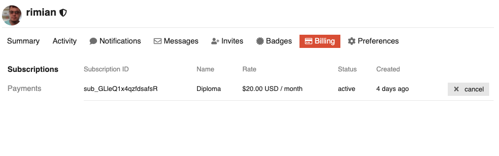
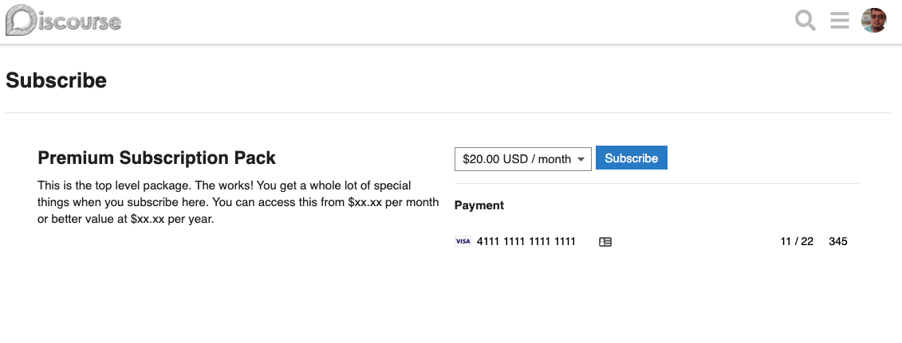

# Discourse Subscriptions

The Discourse Subscriptions plugin allows you to set up a subscription based Discourse application. By integrating with the [Stripe](https://stripe.com) payment gateway and setting up this plugin to manage Subscriptions, you can start selling users access to content on your website.

You can try it out here: https://discourse.rimian.com.au/s/subscribe

See [Screenshots](#screenshots) below.

## Installation

* Be sure your site is enforcing https.
* Follow the install instructions here: https://meta.discourse.org/t/install-a-plugin/19157
* Add your Stripe public and private keys in settings and set the currency to your local value.

## What are Subscriptions?

Subscriptions are how you manage access to your content. There are two core components to make Subscriptions work for your Discourse application. These are **Products** and **Plans**.

A Product describes what the user gets when they subscribe. It has a *name* and *description* and most importantly, it is associated with a Discourse User Group. A product can have one or more plans.

A Plan is how you charge your users for the Product. Plans have *rates*, *billing intervals* and *trial periods*. A Product may have multiple Plans. For example: a yearly and a monthly Plan with different pricing. You can't change plans much once they are created but you can archive them and create new ones.

Together, Products and Plans make up Subscriptions.

It is **important to note** that ultimately, your subscriptions are managed by the Stripe payment gateway. Stripe will handle the billing, etc at the required intervals and notify your Discourse Plugin when something happens. If you were to destroy your instance of Discourse, you will need to cancel all of your subscriptions manually with Stripe. Thankfully, Stripe has a [portal](https://dashboard.stripe.com) where you can manage all that.

## How to set up your Discourse app for subscriptions.

### Set up your payment gateway.

Firstly, you'll need an account with the [Stripe](https://stripe.com) payment gateway. This is how you manage your transactions.

When you get a moment, take a look at Stripe's documentation. But for now, you can set up an account in test mode and see how it all works without making any real transactions. Then, if you're happy with how everything works, you can start taking real transactions. See below for test credit card numbers.

### Set up your User Groups in Discourse

When a user successfully subscribes to your Discourse application, after their credit card transaction has been processed, they are added to a User Group. By assigning users to a User Group, you can manage what your users have access to on your website. User groups are a core functionality of Discourse and this plugin does nothing with them except and and remove users from the group you associated with your Plan.

After you have created a User Group and configured it correctly, you can move onto setting up Discourse Subscriptions.

## Enter your configuration details

When you create an account with Stripe, you'll get a public and private key. These are entered in the Discourse Subscriptions admin so your subscriptions can integrate with Stripe. There are different keys for testing and production environments.

You can also toggle the Subscribe button on and off in case you want to hide the link while you're setting up.

## Create one or more products with plans.

In the admin, add a new Product. Once you have a product saved, you can add plans to it. Keep in mind that the pricing and billing intervals of plans cannot be changed once you create them. This is to avoid confusion around subscription management.

If you take a look at your [Stripe Dashboard](https://dashboard.stripe.com), you'll see all those products and plans are listed. Discourse Subscriptions does not create them locally. They are created in Stripe.

## Testing

Test with these credit card numbers:

* 4111 1111 1111 1111

Visit `/s` and enter a few test transactions.

## Warranty

THIS SOFTWARE IS PROVIDED BY THE COPYRIGHT HOLDERS AND CONTRIBUTORS “AS IS” AND ANY EXPRESS OR IMPLIED WARRANTIES, INCLUDING, BUT NOT LIMITED TO, THE IMPLIED WARRANTIES OF MERCHANTABILITY AND FITNESS FOR A PARTICULAR PURPOSE ARE DISCLAIMED. IN NO EVENT SHALL THE COPYRIGHT OWNER OR CONTRIBUTORS BE LIABLE FOR ANY DIRECT, INDIRECT, INCIDENTAL, SPECIAL, EXEMPLARY, OR CONSEQUENTIAL DAMAGES (INCLUDING, BUT NOT LIMITED TO, PROCUREMENT OF SUBSTITUTE GOODS OR SERVICES; LOSS OF USE, DATA, OR PROFITS; OR BUSINESS INTERRUPTION) HOWEVER CAUSED AND ON ANY THEORY OF LIABILITY, WHETHER IN CONTRACT, STRICT LIABILITY, OR TORT (INCLUDING NEGLIGENCE OR OTHERWISE) ARISING IN ANY WAY OUT OF THE USE OF THIS SOFTWARE, EVEN IF ADVISED OF THE POSSIBILITY OF SUCH DAMAGE.

## Credits

Many thanks to Chris Beach and Angus McLeod who helped on the [previous version](https://github.com/chrisbeach/discourse-donations) of this plugin. Many thanks to the Discourse team who sponsored this plugin! You guys rock.

## Screenshots

### Products Admin

### Product Admin

### Plan Admin

### Subscription Admin

### Subscription User

### Subscribe

