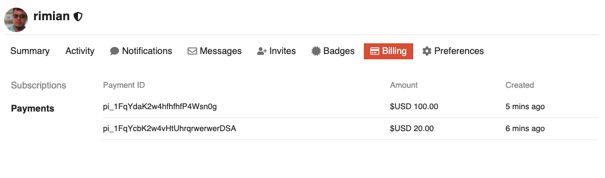
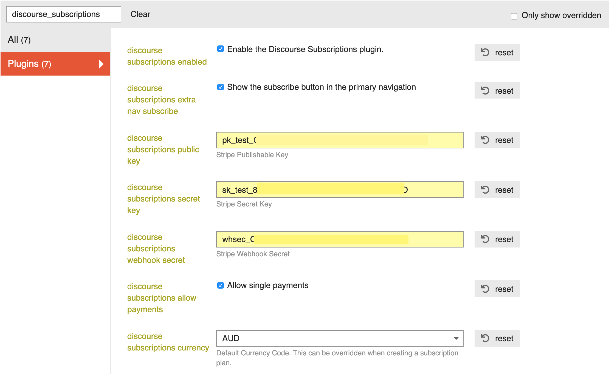

# Discourse Subscriptions

The Discourse Subscriptions plugin allows you to set up a subscription based Discourse application. By integrating with the [Stripe](https://stripe.com) payment gateway and setting up this plugin to manage Subscriptions, you can start selling users access to content on your website.

You can test this plugin here: https://discourse.rimian.com.au/s/subscribe. See [below](#testing) for test credit card numbers.

See [Screenshots](#screenshots) below.

## Sponsorship

This project is partly funded by [discourse.org](https://discourse.org). Many thanks!

If you too would like to sponsor this project, I'd really appreciate it. You can help with development, admin costs or just coffee budget. See here: https://github.com/sponsors/rimian

## Core concepts

### Your Stripe Account

**It is important to note:** that ultimately, your subscriptions are managed by the Stripe payment gateway. Stripe will handle the billing, etc at the required intervals and notify your Discourse Plugin when specific transactions happen on Stripe. If you were to shut down your instance of Discourse, Stripe with continue to bill your customers for your subscriptions.

Stripe has a [portal](https://dashboard.stripe.com) where you can manage all your customers and subscriptions.

### Subscriptions

Subscriptions are how you manage access to your website's content. There are two core components to make Subscriptions work for your Discourse application. These are *Products* and *Plans*.

### Products

A Product describes what the user gets when they subscribe. It has a *name* and *description* and most importantly, it is associated with a Discourse User Group. A product can have one or more plans.

### Plans

A Plan is how you charge your users for the Product. Plans have *rates*, *billing intervals* and *trial periods*. A Product may have multiple Plans. For example: a yearly and a monthly Plan with different pricing. You can't change plans much once they are created but you can archive them and create new ones.

Together, Products and Plans make up Subscriptions.

## Installation

* Be sure your site is enforcing https.
* Follow the plugin install instructions here: https://meta.discourse.org/t/install-a-plugin/19157

## Getting started with Discourse Subscriptions

### Set up your Payment Gateway.

Firstly, you'll need an account with the [Stripe](https://stripe.com) payment gateway. To get started, you can set up an account in test mode and see how it all works without making any real transactions or having to set up a bank account.

### Set up Webhooks and Events in your Stripe account

Once you have an account on Stripe, you'll need to [tell Stripe your website's address](https://dashboard.stripe.com/test/webhooks) so it can notify you about certain transactions. You can enter this in your Stripe dashboard under **Endpoints > URL**.

The address for webhooks is: `[your server address]/s/hooks` where [your server address] is the URL of your discourse install.

You'll also need to tell Stripe which events to notify you about. You can select specific events or all of them. By allowing all events to be sent to your server, you don't have to worry about which events are important to you, but it will load up your server and possibly slow it down. If you're concerned about this, add the events below under **Webhook details**.

Currently, Discourse Subscriptions responds to the following events:

* `customer.subscription.deleted`
* `customer.subscription.updated`

**Warning:** This may change in the future as new features are added to this plugin.

### Add the Stripe keys to your settings

Stripe needs to be authorised to communicate with your website. To do this, it publishes a pair of private and public *API keys* and a *signing secret* for your web hooks.

### Set up your User Groups in Discourse

When a user successfully subscribes to your Discourse application, after their credit card transaction has been processed, they are added to a User Group. By assigning users to a User Group, you can manage what your users have access to on your website. User groups are a core functionality of Discourse and this plugin does nothing with them except and and remove users from the group you associated with your Plan.

After you have created a User Group and configured it correctly, you can move onto setting up Discourse Subscriptions.

## Enter your configuration details

When you create an account with Stripe, you'll get a public and private key. These are entered in the Discourse Subscriptions admin so your subscriptions can integrate with Stripe. There are different keys for testing and production environments.

You can also toggle the Subscribe button on and off in case you want to hide the link while you're setting up.

## Create one or more products with plans.

In the admin, add a new Product. Once you have a product saved, you can add plans to it. Keep in mind that the pricing and billing intervals of plans cannot be changed once you create them. This is to avoid confusion around subscription management.

If you take a look at your [Stripe Dashboard](https://dashboard.stripe.com), you'll see all those products and plans are listed. Discourse Subscriptions does not create them locally. They are created in Stripe.

## Testing

Test with these credit card numbers:

* 4111 1111 1111 1111 (no authentication required)
* 4000 0027 6000 3184 (authentication required)

For more test card numbers: https://stripe.com/docs/testing

Visit `/s` and enter a few test transactions.

## Credits

Many thanks to Chris Beach and Angus McLeod who helped on the [previous version](https://github.com/chrisbeach/discourse-donations) of this plugin. Many thanks to the Discourse team who sponsor this plugin! You guys rock. If you would like to contribute vis sponsorship to this project see: https://github.com/sponsors/rimian

## Screenshots

### Products Admin

### Product Admin

### Plan Admin

### Subscription Admin

### Subscription User

### Payments User

### Subscribe

### Settings

## Warranty

THIS SOFTWARE IS PROVIDED BY THE COPYRIGHT HOLDERS AND CONTRIBUTORS “AS IS” AND ANY EXPRESS OR IMPLIED WARRANTIES, INCLUDING, BUT NOT LIMITED TO, THE IMPLIED WARRANTIES OF MERCHANTABILITY AND FITNESS FOR A PARTICULAR PURPOSE ARE DISCLAIMED. IN NO EVENT SHALL THE COPYRIGHT OWNER OR CONTRIBUTORS BE LIABLE FOR ANY DIRECT, INDIRECT, INCIDENTAL, SPECIAL, EXEMPLARY, OR CONSEQUENTIAL DAMAGES (INCLUDING, BUT NOT LIMITED TO, PROCUREMENT OF SUBSTITUTE GOODS OR SERVICES; LOSS OF USE, DATA, OR PROFITS; OR BUSINESS INTERRUPTION) HOWEVER CAUSED AND ON ANY THEORY OF LIABILITY, WHETHER IN CONTRACT, STRICT LIABILITY, OR TORT (INCLUDING NEGLIGENCE OR OTHERWISE) ARISING IN ANY WAY OUT OF THE USE OF THIS SOFTWARE, EVEN IF ADVISED OF THE POSSIBILITY OF SUCH DAMAGE.
